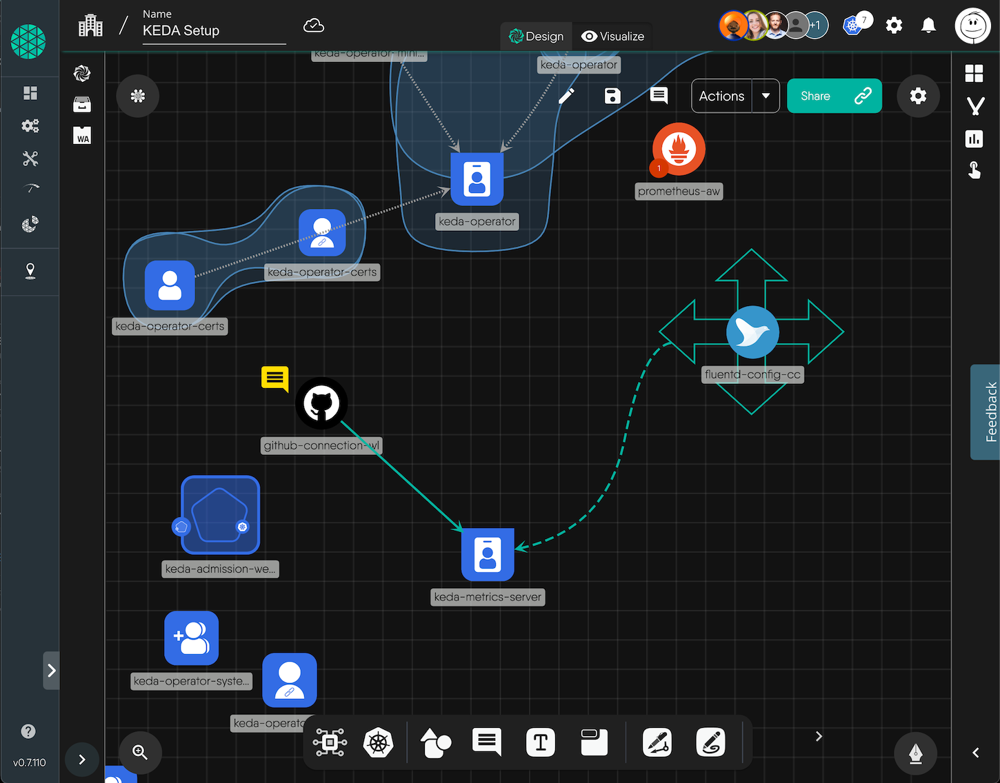

<p style="text-align:center;" align="center"><a href="https://meshery.io"><picture>
 <source media="(prefers-color-scheme: dark)" srcset="https://raw.githubusercontent.com/meshery/meshery/master/.github/assets/images/readme/meshery-logo-light-text-side.svg">
 <source media="(prefers-color-scheme: light)" srcset="https://raw.githubusercontent.com/meshery/meshery/master/.github/assets/images/readme/meshery-logo-dark-text-side.svg">
</picture></a><br /><br /></p>
<p align="center">
<a href="https://hub.docker.com/r/meshery/meshery" alt="Docker pulls">
  </a>
<a href="https://github.com/issues?q=is%3Aopen%20is%3Aissue%20archived%3Afalse%20(org%3Ameshery%20OR%20org%3Aservice-mesh-performance%20OR%20org%3Aservice-mesh-patterns%20OR%20org%3Ameshery-extensions)%20label%3A%22help%20wanted%22" alt="GitHub issues by-label">
  </a>
<a href="https://github.com/meshery/meshery/blob/master/LICENSE" alt="LICENSE">
  </a>
<a href="https://artifacthub.io/packages/helm/meshery/meshery" alt="Artifact Hub Meshery">
  </a>  
<a href="https://goreportcard.com/report/github.com/meshery/meshery" alt="Go Report Card">
  </a>
<a href="https://github.com/meshery/meshery/actions" alt="Build Status">
  </a>
<a href="https://bestpractices.coreinfrastructure.org/projects/3564" alt="CLI Best Practices">
  </a>
<a href="https://discuss.meshery.io" alt="Discuss Users">
  </a>
<a href="https://slack.meshery.io" alt="Join Slack">
  </a>
<a href="https://twitter.com/intent/follow?screen_name=mesheryio" alt="Twitter Follow">
  </a>
<a href="https://github.com/meshery/meshery/releases" alt="Meshery Downloads">
  </a>  
<a href="https://gurubase.io/g/meshery" alt="Meshery Guru">
  </a> 
<!-- <a href="https://app.fossa.com/projects/git%2Bgithub.com%2Fmeshery%2Fmeshery?ref=badge_shield" alt="License Scan Report">
  </a>  
  -->
</p>

<h5><p align="center"><i>If you like Meshery, please <a href="https://github.com/meshery/meshery/stargazers">★</a> this repository to show your support! 🤩</i></p></h5>
<p align="center" >
MESHERY IS A CLOUD NATIVE COMPUTING FOUNDATION PROJECT
</p>

<div align="center" width="100%">


</div>
<br />
<p align="center">
A self-service engineering platform, <a href="https://meshery.io">Meshery</a>, is the open source, cloud native manager that enables the design and management of all Kubernetes-based infrastructure and applications (multi-cloud). Among other features,  As an extensible platform, Meshery offers visual and collaborative GitOps, freeing you from the chains of YAML while managing Kubernetes multi-cluster deployments.
</p>
<br />

<div align="center" width="100%">
 <a href="https://youtu.be/Do7htKrRzDA"></a>
 <p><i>Example extension. See other <a href="https://meshery.io/extensions">Meshery Extensions</a>.</i></p>
 <br />Try Meshery in the <a href="https://play.meshery.io">Cloud Native Playground</a> (<a href="https://www.youtube.com/watch?v=034nVaQUyME&list=PL3A-A6hPO2IO_yzN83wSJJUNQActzCJvO&index=9">teaser video</a>)
</div>

<br />
<!--
- [Functionality](#functionality)
  - [Meshery Architecture](#meshery-architecture)
  - [Join the Meshery community!](#join-the-meshery-community)
  - [Contributing](#contributing)
    - [Stargazers](#stargazers)
    - [License](#license)
-->
<!-- <p style="clear:both;">&nbsp;</p>
<a href="https://meshery.io"><picture>
  <source media="(prefers-color-scheme: dark)" srcset="https://raw.githubusercontent.com/meshery/meshery/master/.github/assets/images/readme/meshery-logo-light-text-side.svg">
  <source media="(prefers-color-scheme: light)" srcset="https://raw.githubusercontent.com/meshery/meshery/master/.github/assets/images/readme/meshery-logo-dark-text-side.svg">
  
  </picture></a> 
<a href="https://meshery.io">
<h3 style="margin:auto;"><br /><br />
  <a href="https://docs.google.com/presentation/d/14kxjwYSJ_FyE3K_6CDEd6oq2kqwn0OSE8RDJ4H-KlKU/edit?usp=sharing"><center><i>Project Overview Presentation</i></center></a>
  <br /><br /><br />
</h3> -->
<p style="clear:both;">&nbsp;</p>

Visit https://qa.meshery.io for the Meshery project quality assurance dashboard.

### Published reports

The dashboard is generated by `make report-build` (config in `allurerc.mjs`) and
deployed to GitHub Pages. Each report is a filtered view over one shared pool of
Allure results, selected by test labels:

| Report | Selects results where |
| --- | --- |
| Dashboard | all results (aggregate) |
| Meshery | `project == "Meshery"` |
| Mesheryctl | `project == "mesheryctl"` |
| **Connection Lifecycle** | `testGroup == "Connection Lifecycle"` (Test Plan Test Group, col B); transitionally, results carrying **no** `testGroup` label also match the legacy `epic == "Kubernetes Connections"` / Kubernetes `componentUnderTest` fallback (UI + CLI connection tests, grouped by `client`) |
| Extension: Remote Provider Layer5 Cloud | `project == "Layer5Cloud"` |
| Extension: Kanvas | `project == "Kanvas"` |

The Connection Lifecycle report is a **Test-Group-keyed view**: each test is
tagged at its source (UI Playwright specs, CLI converters) with a `testGroup`
label whose value is the Meshery Test Plan "Latest" tab Test Group (column B).
The report filters on `testGroup == "Connection Lifecycle"`. This pattern
**generalizes to one filtered report per Test Group** - any Test Group can get
its own report by keying a plugin's filter on its `testGroup` value. Tagged
tests still appear in their `project` report; this is an additional
cross-client (`UI`|`CLI`) lens.

Transitionally, a result that carries **no** `testGroup` label at all also
matches the legacy epic-based selector (`epic == "Kubernetes Connections"`, with
a Kubernetes `componentUnderTest` fallback for results carrying no `epic` label)
so the report stays populated with connection results emitted before the
`testGroup` label existed. A result that already carries a `testGroup` is
authoritative - it is never pulled in by the legacy fallback even if its
component looks like Kubernetes - so once every connection result carries
`testGroup`, the fallback can be removed with no change in membership. The
report is published at https://qa.meshery.io/connections/ (the plugin key is
kept stable so the URL is unchanged).

<p style="clear:both;">&nbsp;</p>


<div>&nbsp;</div>

## Cloning this repository (use a sparse clone)

This repository is the QA dashboard's data store: it aggregates [Allure](https://allurereport.org/) test results from across the Meshery ecosystem. Every CI run commits fresh raw results and regenerated per-PR reports, so a full clone is **tens of gigabytes and grows continuously**. Almost none of that data is needed to work on the dashboard itself (its build scripts, styling, and report configuration).

Unless you specifically need the historical test data, **clone sparsely**. You still get the full commit history and everything required to build the report, while skipping the multi-gigabyte result and report directories.

The following directories hold generated test data and are safe to exclude (they are populated by `make *-results-sync` and `make report-build`):

| Directory | Contents |
| --- | --- |
| `meshery-results/` | Raw Allure results for Meshery integration tests |
| `meshery-server-results/` | Raw Allure results for Meshery Server Go unit tests |
| `mesheryctl-results/` | Raw Allure results for `mesheryctl` tests (deprecated - split into the two dirs below) |
| `mesheryctl-bats-results/` | Raw Allure results for `mesheryctl` BATS e2e tests |
| `mesheryctl-unit-results/` | Raw Allure results for `mesheryctl` Go unit tests |
| `kanvas-results/` | Raw Allure results for Kanvas (extension) |
| `remote-provider-results/` | Raw Allure results for the Remote Provider (extension) |
| `pr-reports/` | Generated per-PR HTML reports (the largest contributor to repo size) |

### Recommended: sparse clone that excludes test results

```bash
# 1. Blobless partial clone - fetches history metadata, not every file's contents
git clone --no-checkout --filter=blob:none https://github.com/meshery/qa.git
cd qa

# 2. Check out everything EXCEPT the large test-result / report directories
git sparse-checkout set --no-cone \
  '/*' \
  '!/meshery-results/' \
  '!/meshery-server-results/' \
  '!/mesheryctl-results/' \
  '!/mesheryctl-bats-results/' \
  '!/mesheryctl-unit-results/' \
  '!/kanvas-results/' \
  '!/remote-provider-results/' \
  '!/pr-reports/'

# 3. Populate the working tree
git checkout master
```

This yields a working tree of a few hundred MB instead of tens of GB. `--filter=blob:none` makes it a [partial clone](https://git-scm.com/docs/partial-clone), so Git transparently fetches any excluded file on demand if you ever check one out - nothing is permanently lost, and `git log`/`git blame` keep working across the full history.

### Already have a full clone?

Apply the same sparse rules to an existing checkout to reclaim working-tree space (this prunes the working tree only; it does not shrink `.git`):

```bash
cd qa
git sparse-checkout set --no-cone \
  '/*' \
  '!/meshery-results/' '!/meshery-server-results/' '!/mesheryctl-results/' \
  '!/mesheryctl-bats-results/' '!/mesheryctl-unit-results/' \
  '!/kanvas-results/' '!/remote-provider-results/' '!/pr-reports/'
```

### Need one of the excluded directories later?

Re-include a directory at any time - for example, to bring back `meshery-results/`:

```bash
git sparse-checkout add '/meshery-results/'
```

Or restore the full working tree entirely:

```bash
git sparse-checkout disable
```

> Requires Git 2.25+ for `git sparse-checkout`; Git 2.27+ is recommended for partial-clone support.

<p style="clear:both;">&nbsp;</p>


<div>&nbsp;</div>

## Join the Meshery community!

<a name="contributing"></a><a name="community"></a>
Our projects are community-built and welcome collaboration. 👍 Be sure to see the <a href="https://meshery.io/community/newcomers">Contributor Journey Map</a>. Jump into community <a href="https://slack.meshery.io">Slack</a> or <a href="https://discuss.meshery.io">discussion forum</a> to participate.

<p style="clear:both;">
<a href ="https://meshery.io/community"></a>
<h3>Find your MeshMate</h3>

<p>MeshMates are experienced Meshery community members, who will help you learn your way around, discover live projects, and expand your community network. Connect with a Meshmate today!</p>

Learn more about the <a href="https://meshery.io/community#meshmates">MeshMates</a> program. <br />

</p>
<br /><br />
<div style="display: flex; justify-content: center; align-items:center;">
<div>
<a href="https://meshery.io/community"></a>
</div>
<div style="width:60%; padding-left: 16px; padding-right: 16px">
<p>
✔️ <em><strong>Join</strong></em> any or all of the weekly meetings on <a href="https://meshery.io/calendar">community calendar</a>.<br />
✔️ <em><strong>Watch</strong></em> community <a href="https://www.youtube.com/@mesheryio?sub_confirmation=1">meeting recordings</a>.<br />
✔️ <em><strong>Fill-in</strong></em> a <a href="https://meshery.io/newcomers">member form</a> and gain access to community resources.
<br />
✔️ <em><strong>Discuss</strong></em> in the <a href="https://discuss.meshery.io">community forum</a>.<br />
✔️ <em><strong>Explore more</strong></em> in the <a href="https://meshery.io/community#handbook">community handbook</a>.<br />
</p>
</div><br /><br />
<div>
<a href="https://slack.meshery.io">
<picture>
  <source media="(prefers-color-scheme: dark)" srcset="https://raw.githubusercontent.com/meshery/meshery/master/.github/assets/images/readme/slack.svg"  width="110px" />
  <source media="(prefers-color-scheme: light)" srcset="https://raw.githubusercontent.com/meshery/meshery/master/.github/assets/images/readme/slack.svg" width="110px" />
  
</picture>
</a>
</div>
</div>
<br /><br />
<p align="left">
&nbsp;&nbsp;&nbsp;&nbsp; <i>Not sure where to start?</i> Grab an open issue with the <a href="https://github.com/issues?q=is%3Aopen%20is%3Aissue%20archived%3Afalse%20(org%3Ameshery%20OR%20org%3Aservice-mesh-performance%20OR%20org%3Aservice-mesh-patterns%20OR%20org%3Ameshery-extensions)%20label%3A%22help%20wanted%22">help-wanted label</a>.
</p>
<br /><br />

<div>&nbsp;</div>

## Contributing

Please do! We're a warm and welcoming community of open source contributors. Please join. All types of contributions are welcome. Be sure to read the [Contributor Guides](https://docs.meshery.io/project/contributing) for a tour of resources available to you and how to get started.

<!-- <a href="https://youtu.be/MXQV-i-Hkf8"></a> -->

<div>&nbsp;</div>

### Stargazers

<p align="center">
  <i>If you like Meshery, please <a href="../../stargazers">★</a> star this repository to show your support! 🤩</i>
 <br />
<a href="../../stargazers">
 
</a></p>

### License

This repository and site are available as open-source under the terms of the [Apache 2.0 License](https://opensource.org/licenses/Apache-2.0).


<!--### Community


## See Meshery in Action

- [DockerCon 2020](https://docker.events.cube365.net/docker/dockercon/content/Videos/63TCCNpzDC7Xxnm8b) | ([video](https://www.youtube.com/watch?v=5BrbbKZOctw&list=PL3A-A6hPO2IN_HSU0pSfijBboiHggs5mC&index=4&t=0s), [deck](https://calcotestudios.com/talks/decks/slides-dockercon-2020-service-meshing-with-docker-desktop-and-webassembly.html))
- [Deploying Linkerd with Meshery](https://youtu.be/MXQV-i-Hkf8)
- Istio Founders Meetup @ KubeCon EU 2019 | [deck](https://calcotestudios.com/talks/decks/slides-istio-meetup-kubecon-eu-2019-istio-at-scale-large-and-small.html)
- [Cloud Native Rejekts EU 2019](https://cfp.cloud-native.rejekts.io/cloud-native-rejekts-eu-2019/speaker/GZQTEM/) | [deck](https://calcotestudios.com/talks/decks/slides-cloud-native-rejekts-2019-evaluating-service-meshes.html)
- [DockerCon 2019 Open Source Summit](https://dockercon19.smarteventscloud.com/connect/sessionDetail.ww?SESSION_ID=309149&tclass=popup#.XJxH-TOcbjI.twitter) | [deck](https://calcotestudios.com/talks/decks/slides-dockercon-2019-establishing-an-open-source-office.html), [video](https://www.docker.com/dockercon/2019-videos?watch=open-source-summit-service-mesh)
- [Container World 2019](https://tmt.knect365.com/container-world/speakers/lee-calcote) | [deck](https://calcotestudios.com/talks/decks/slides-container-world-2019-service-meshes-but-at-what-cost.html)
- [Service Mesh Day](https://servicemeshday.com/schedule.html) | [deck](https://docs.google.com/presentation/d/1HwG03okX3DHgGKbma4PL-MO7Xr9zDrjQgd05PRi9i8E/edit?usp=sharing), [video](https://youtu.be/CFj1O_uyhhs)
- [Innotech San Antonio](https://innotechsanantonio2019.sched.com/event/Lmlb/the-enterprise-path-to-service-mesh-architectures?iframe=no&w=100%&sidebar=yes&bg=no) | [deck](https://calcotestudios.com/talks/decks/slides-innotech-san-antonio-2019-the-enterprise-path-to-service-mesh.html)
- [CNCF Networking WG](https://github.com/cncf/wg-networking) | [deck](https://www.slideshare.net/leecalcote/benchmarking-service-meshes-cncf-networking-wg-141938576), [video](https://www.youtube.com/watch?v=2_JwCc-kLMA&list=PLYjO73_1efChX9NuRaU7WocTbgrfvCoPE)
-->
